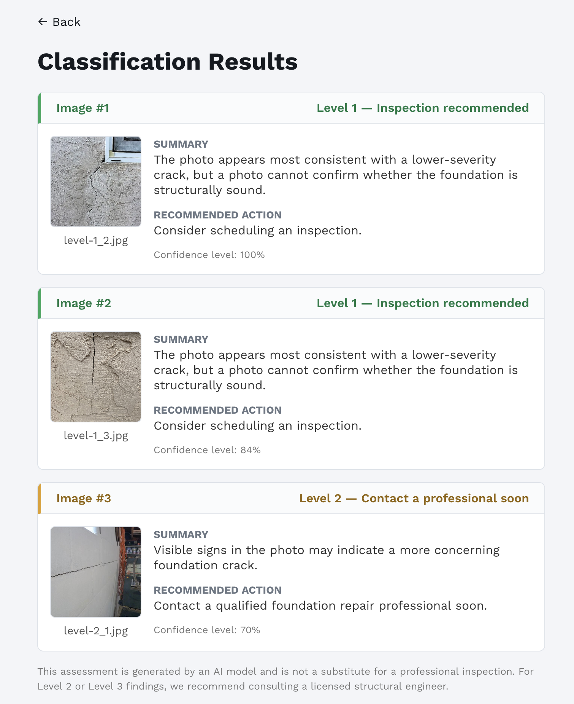

# Foundation Crack Classifier

React SPA, FastAPI backend, and an image classifier that classifies photos of
foundation cracks into a severity level and recommended next step.

Accepts uploads of one or multiple photos.

> **Not a structural diagnosis.** Results are AI triage based on a single photo.
> A qualified foundation professional should inspect the area before any decision.
 


## Severity levels

Each image is classified into one of four labels:

| Label | Meaning | Urgency |
|-------|---------|---------|
| **Level 1** | Thin hairline / cosmetic cracks, no displacement | Inspection recommended |
| **Level 2** | Horizontal, stair-step, or widening cracks; water staining; multiple cracks | Contact a professional soon |
| **Level 3** | Wall bowing, major displacement, partial/full collapse | Contact a professional immediately |
| **Unclear** | Blurry, obstructed, non-foundation, or otherwise unjudgeable photos | Unable to assess |

See [`classifier/README.md`](classifier/README.md) for the full labeling guide
used to build the training set.

## Architecture

- Web (React SPA)
- API (FastAPI)
- Classifier (PyTorch model buitl on top of MobileNetV3)

## Quick start

All commands below run from the **repository root**.

The API needs a trained model checkpoint before it can classify. Train one first
(this reads labeled images from `classifier/training_images/` and writes
`classifier/models/crack_severity_model.pt`):

```bash
docker compose run --rm classifier python -m foundation_crack_classifier.train
```

Then bring up the API and web app:

```bash
docker compose up -d api web
```

- Web UI: <http://localhost:8001>
- API: <http://localhost:8000> (health check: <http://localhost:8000/health>)

Stop everything:

```bash
docker compose down
```

## Working with each component

### Classifier

```bash
# Run tests
docker compose run --rm classifier pytest -q

# Train (writes models/ and label_map.json / training_config.json)
docker compose run --rm classifier python -m foundation_crack_classifier.train

# Evaluate (writes reports/evaluation.json and confusion_matrix.png)
docker compose run --rm classifier python -m foundation_crack_classifier.evaluate

# Classify a single image placed in classifier/input/
docker compose run --rm classifier \
  python -m foundation_crack_classifier.infer /app/input/photo.jpg
```

Training is configurable via CLI flags or `FCC_*` environment variables
(epochs, batch size, learning rate, image size, backbone, seed). Defaults:
5 epochs, batch size 16, 224px images, pretrained MobileNetV3.

### API

```bash
# Start in the background
docker compose up -d api

# Classify one or more images
curl -X POST http://localhost:8000/classify \
  -F "files=@classifier/input/photo.jpg"

# Run tests
docker compose run --rm api pytest -q
```

### Web

The web app is served by the Vite dev server inside its container.

```bash
# Start the dev server (proxied to http://localhost:8001)
docker compose up web

# Run tests
docker compose run --rm web npm test
```

The frontend reads the API base URL from `VITE_API_BASE_URL`
(default `http://localhost:8000`, set in `docker-compose.yml`).